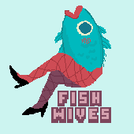
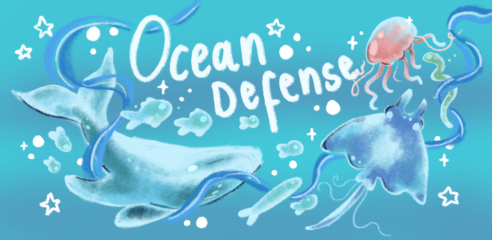
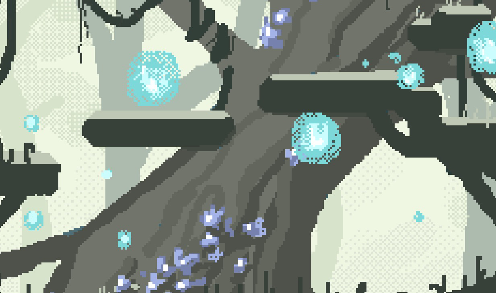
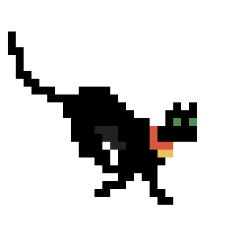

  

<h1 align="center">Fishwives Studio</h1>

South African Indie game studio creating cozy, story-driven games that we've always wanted to play ourselves!

---

## About Us

Fishwives Studio is a small independent game studio focused on creating memorable games with strong visual identity and satisfying gameplay systems.

Our work combines handcrafted art, thoughtful design, and technical development to build worlds players enjoy returning to.

The studio was started by two developers working closely together across all projects, with more artists and friends joining for upcoming projects!

---

## Released Game

## Ocean Defense

  

**Platforms:** Android • iOS

Ocean Defense is a mobile **tower defense game** where players defend a coral reef from human invaders.

Survive endless waves of enemies while upgrading your coral tower with powerful abilities and unlocking permanent upgrades between runs.

**Features**

* Endless escalating waves
* Strategic upgrade cards that modify tower abilities
* Permanent progression system
* Hand-drawn ocean themed art

---

## Upcoming Game

## Catformer *(working title)*

A **2D platformer** where you play as a lost cat trying to find its way home.

Players explore colourful environments, traverse challenging platforms, and slowly uncover lost items that lead you back home. 
Catformer is a pixel art game with emotional storytelling and magical enviroments to explore. And obviously there is a purr button!

### Early Sneak Peeks

  

  

---

## Technology

Our games are primarily developed using **Godot** for 2D projects.

For future 3D titles we are exploring **Unity** and **Unreal Engine**.

---

## Contact

For feedback, collaboration inquiries, or business contact:

**[fishwivesstudio@outlook.com](mailto:fishwivesstudio@outlook.com)**

---

© Fishwives Studio
